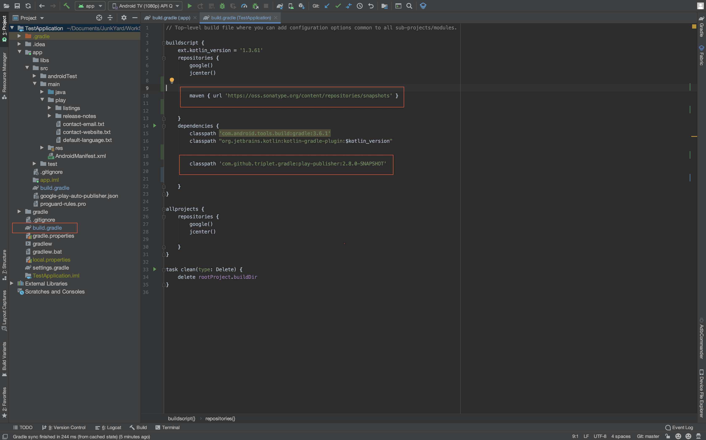
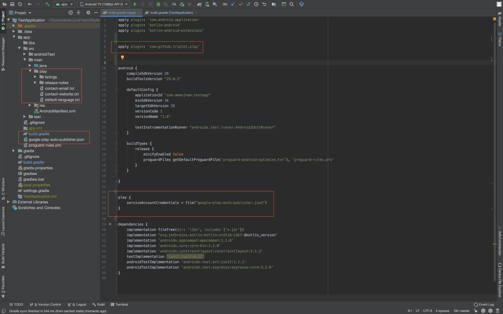

Gradle Play Publisher Demo 
========================================

This is very useful plugin for building, uploading, and then promoting your App Bundle or APK to publishing app listings and other metadata in google play console.

Step 1 - Add Gradle Play Publisher Dependencies
-----

Open your build.gradle (Project Level) file, add the following to the very top.

```gradle

buildscript {
    repositories {
         maven { url 'https://oss.sonatype.org/content/repositories/snapshots' }
    }
    dependencies {
          classpath 'com.github.triplet.gradle:play-publisher:2.8.0-SNAPSHOT'
    }
}
```
Open your app/build.gradle (Module: app) file, add the following to the very top.

```gradle

apply plugin: 'com.github.triplet.play'

play {
    serviceAccountCredentials = file("your-server-acount-key.json")
}

```

Step 2 - For Retrieve Play store listing assets
------

Download all play store listing such as icon, feature-graphic, promo-graphic, tablet-screenshots, large-tablet-screenshots, tv-banner , tv-screenshots, wear-screenshots, title, short description, detailed description.

```gradle

./gradlew bootstrap --product

```

Step 3 - For Updating the Play store listing
------

Using this command can update the play store listing such as icon, feature-graphic, promo-graphic, tablet-screenshots, large-tablet-screenshots, tv-banner , tv-screenshots, wear-screenshots, title, short description, detailed description.


```gradle

./gradlew publishProducts

```






More info can be also be found in the [Gradle Play Publisher](https://github.com/Triple-T/gradle-play-publisher/blob/master/README.md).

To get the Service Account json key follow this [Google Play Developer API](https://developers.google.com/android-publisher/getting_started)


LIMITATION
-----
The first APK or App Bundle needs to be uploaded via the Google Play Console because registering the app with the Play Store cannot be done using the Play Developer API. For all subsequent uploads and changes, GPP may be used.

SUPPORT ❤️
-----

Find this demo useful? Support it by joining [**stargazers**](https://github.com/aman-jham/google-gradle-play-publisher-demo/stargazers) for this repository ⭐️
<br/>
And [**follow me**](https://github.com/aman-jham?tab=followers) for my next creations 👍

